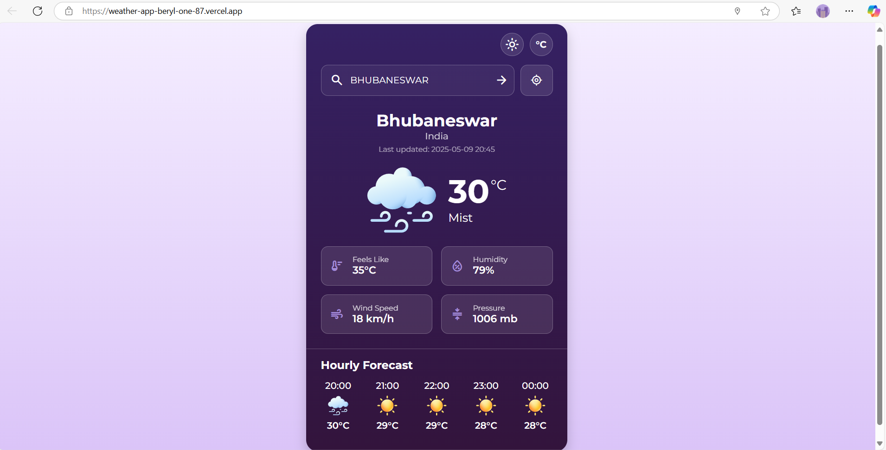

# ☀️ Weather Now – Your Real-Time Weather Companion

[](https://weather-app-beryl-one-87.vercel.app)
[]()

---

## 🌤️ Overview

**Weather Now** is a sleek and modern weather application that provides real-time weather updates for cities around the world. Whether you're planning a trip or just curious about your local forecast, this app has you covered with clean design and quick responses.

> 🌍 [Try the Live App](https://weather-app-beryl-one-87.vercel.app)

---


## 🔥 Key Features

- 🌦️ **Real-time Weather Data**: Fetches current weather conditions from the WeatherAPI.
- 🕒 **Hourly Forecast**: Shows weather predictions for the next 24 hours.
- 📊 **Detailed Weather Information**: Displays feels-like temperature, humidity, wind speed, and pressure.
- 📱 **Responsive Design**: Works seamlessly on mobile, tablet, and desktop devices.
- 🌙 **Theme Options**: Choose between dark and light themes based on your preference.
- 🌡️ **Unit Conversion**: Switch between Celsius and Fahrenheit temperature units.


---

## 🧰 Tech Stack

- **Framework:** React.js
- **Styling:** Tailwind CSS
- **API:** OpenWeatherMap API
- **Hosting:** Vercel

---

## 📸 Screenshots


| Desktop View |
|  | 
| Mobile View |
.png) |

---

## 🚀 Getting Started

```bash
# Clone the repository
git clone https://github.com/your-username/weather-now.git

# Navigate into the project directory
cd weather-now

# Install dependencies
npm install

# Create a .env.local file and add your API key
NEXT_PUBLIC_WEATHER_API_KEY=your_openweather_api_key

# Start the development server
npm run dev
```

---

## 📌 Environment Variables

Make sure to create a `.env.local` file in your root directory with the following key:

```env
NEXT_PUBLIC_WEATHER_API_KEY=your_openweather_api_key
```

---

## 🚧 Future Enhancements

- 🌓 Dark Mode toggle
- 🗺️ Search history and recent searches
- 📅 5-day weather forecast
- 🌎 Auto-detect user location

---

## 👩‍💻 Developer

**Subhasmita Sahoo**  
Frontend Developer | UI/UX Enthusiast | Weather App Creator | Code Crafter

📍 Khordha, Odisha  
📫 [Email](mailto: subhasmita4602@gmail.com)  
🌐 [Portfolio](#) | 💼 [LinkedIn](https://www.linkedin.com/in/subhasmita-sahoo-puja/) | 💻 [GitHub](https://github.com/subhasmita-puja)


---

## 📄 License

This project is licensed under the [MIT License](LICENSE).

---

> ⭐ If you find this useful, give it a star on GitHub!
